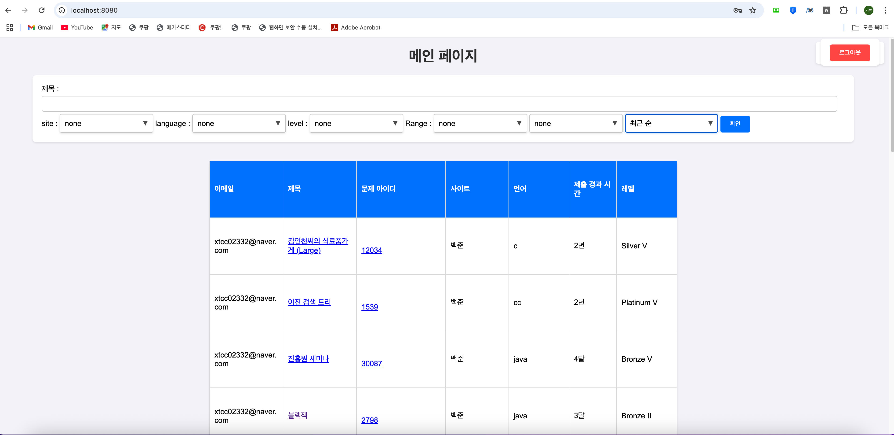
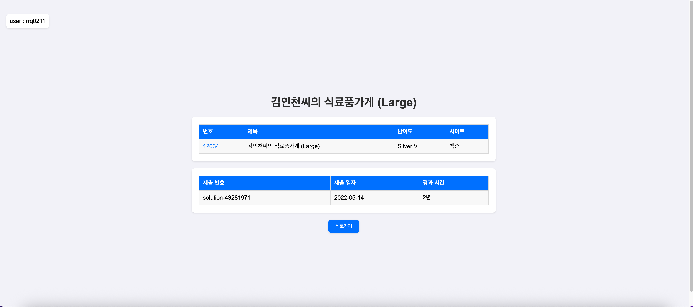
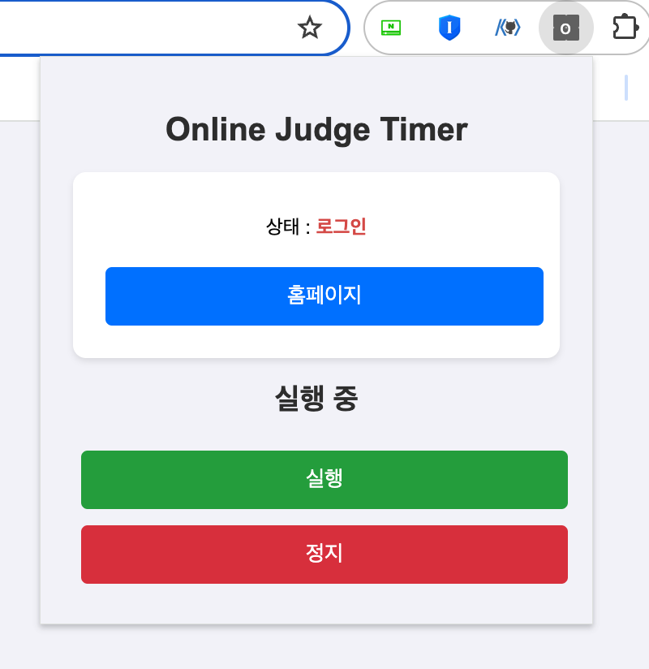
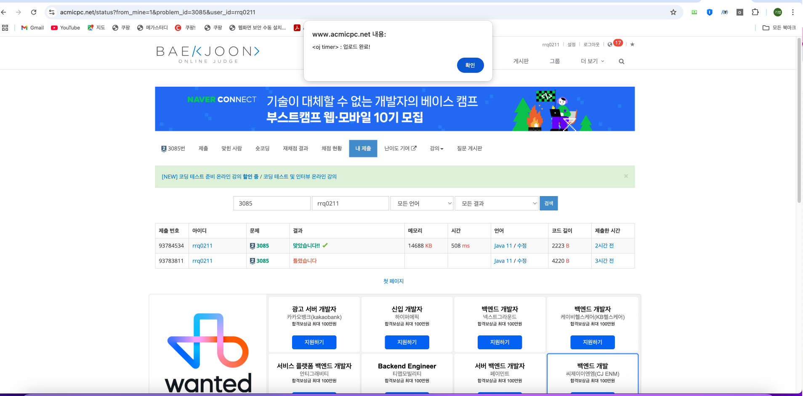

# oj-timer

##### -  프로젝트 개요
내가 풀었던 온라인 코딩테스트 문제들을 언제 풀었는지, 풀고 난 후 얼마나 시간이 경과됐는지 확인할 수 있는 서비스.

📚 기술 스택
 
 

spring boot, spring jpa, mysql, redis, mybatis, querydsl

 

#### 서비스
|메인|상세|
| :-: | :-: |
|||

|확장 프로그램 팝업|확장 프로그램 동작|
| :-: | :-: |
|||
